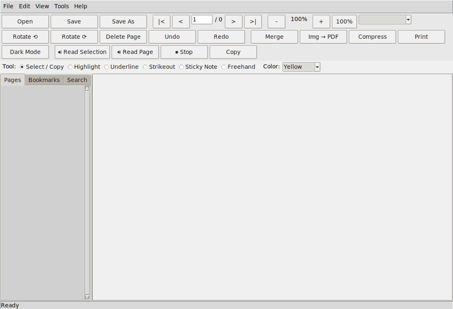
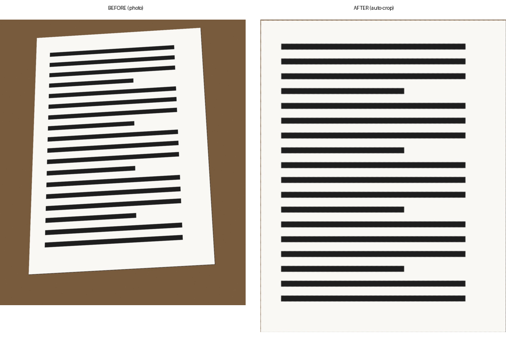

<div align="center">


# FeatherPDF

### A fully-featured PDF viewer & toolkit that stays genuinely lightweight

[](LICENSE)
[](https://www.python.org/)
[](#tech-stack)
[](#installation)

Three lightweight core dependencies, one fully optional. No Qt, no
bundled browser engine, no OpenCV unless you specifically want the
auto-crop feature. Just a fast, small, no-nonsense PDF app.

**Made by [Mehedy](https://mehedy.netlify.app)**

</div>

---

<div align="center">

<br>
<sub>Real screen capture — opening a doc, navigating, zooming, selecting real text, highlighting it, and toggling dark mode.</sub>
</div>

---

## Download

Prebuilt Windows executables are attached to **[GitHub Releases](https://github.com/mehedyk/Featherpdf/releases/latest)**
— not committed to this repo directly (large binaries bloat git history
forever, so they live as release attachments instead; see
[RELEASING.md](RELEASING.md) if you're maintaining this project and need
to publish a new one).

| I want... | Download | Size |
|---|---|---|
| The easiest install — Start Menu shortcut, uninstaller, the works | **[FeatherPDF-Setup.exe](https://github.com/mehedyk/Featherpdf/releases/latest/download/FeatherPDF-Setup.exe)** | ~114 MB |
| One single file, no install — just run it | **[FeatherPDF-Portable.exe](https://github.com/mehedyk/Featherpdf/releases/latest/download/FeatherPDF-Portable.exe)** | ~52 MB |
| Auto-Crop working immediately, no separate setup | **[FeatherPDF-AutoCrop.zip](https://github.com/mehedyk/Featherpdf/releases/latest/download/FeatherPDF-AutoCrop.zip)** | ~300 MB |

Not sure which one? Get **FeatherPDF-Setup.exe** — that's the one most
people want. See [Auto-Crop](#auto-crop-optional) if you're deciding
whether you need that third option specifically.


---

## Table of contents

- [Download](#download)
- [Why FeatherPDF](#why-featherpdf)
- [Features](#features)
- [Installation](#installation)
- [Building a standalone executable](#building-a-standalone-executable)
- [Building a proper installer](#building-a-proper-installer-recommended-for-sharing)
- [Auto-Crop (optional)](#auto-crop-optional)
- [Project structure](#project-structure)
- [Usage](#usage)
- [Known limitations](#known-limitations)
- [License](#license)

## Why FeatherPDF

Most "full-featured" PDF apps ship 150–400 MB of Electron/Qt/Chromium
just to show you a page. FeatherPDF packs viewing, editing, annotating,
merging, converting, compressing, and reading-aloud into a **~114 MB**
standard build (or **~52 MB** as a single-file executable — see
[Building a standalone executable](#building-a-standalone-executable) for
both, with real measured numbers, not marketing estimates) — because the
entire feature set sits on top of just **three** small third-party
libraries (plus Tkinter, which ships with Python itself):

<a name="tech-stack"></a>

| Library | What it does here |
|---|---|
| 🐍 **PyMuPDF** | All PDF logic — rendering, merge/split, text extraction, annotations, search, compression |
| 🖼️ **Pillow** | Image filters for the scan-effect / CamScanner-style conversion, dark-mode inversion |
| 🔊 **pyttsx3** | Read Aloud — a thin wrapper that calls your OS's own built-in speech engine, no bundled voice model |
| 🪟 **Tkinter** | The entire interface — built into Python, zero extra install |
| 🧠 **OpenCV** *(optional)* | Powers just the Auto-Crop feature — not installed by default, see [Auto-Crop](#auto-crop-optional) |

That's it. No Electron shell, no Chromium, no Qt runtime — and no OpenCV
either, unless you specifically opt into Auto-Crop.

---

## Features

### 👁️ Viewing
- Zoom in / out, actual size (100%), Fit Width, Fit Page, Fit Screen
- Page navigation: next/prev, first/last, jump-to-page
- Thumbnail sidebar, bookmark/outline sidebar, full-text search with match navigation
- Rotate page view, dark mode (inverted page colors for reading)
- Multiple PDFs open at once, each in its own tab
- **Real text selection** — click-drag over text selects the actual words
  (via PyMuPDF's word positions), not just an approximate box
- **Copy** selected text to the system clipboard (`Ctrl+C`, right-click menu, or toolbar)
- **Read aloud** 🔊 — speaks the current selection or the whole page out
  loud, using your OS's own built-in speech engine (no bundled voice model)

### ✏️ Editing & page operations
- Delete a page or a page range, insert blank pages, reorder pages (move
  up/down or via the thumbnail panel)
- Permanent page rotation (saved with the file)
- Undo / redo

### 🖍️ Annotations
- Highlight, underline, strikeout, sticky notes, freehand drawing —
  click-and-drag directly on the page. Drag over real text and the
  annotation snaps to the exact words; drag over empty space (like a
  diagram) and it falls back to marking the dragged rectangle.

### 🛠️ File tools
- Merge multiple PDFs into one (with reorder-before-merge)
- Split a PDF every N pages, or extract a specific page range into a new file
- Image → PDF conversion, with three "document style" effects:
  - Color (contrast + sharpen)
  - Grayscale
  - Black & white "scanned document" look (adaptive thresholding, CamScanner-style)
- **Auto-Crop** *(optional, requires OpenCV)* — automatically detects a
  photographed document's edges and perspective-corrects it, even at a
  real skewed angle, straightening it into a clean rectangle before
  applying the style above. See [Auto-Crop](#auto-crop-optional) below.
- Compress a PDF by downsampling only the images that exceed a DPI
  threshold — nothing is touched unless it's genuinely higher resolution
  than needed, so there's no visible quality loss
- Document metadata editing (title/author/subject/keywords)
- Password-protect a copy (AES-256 encryption)
- Print via the OS's native print handling

### 📱 Interface that fits *your* window
Both toolbars auto-wrap their buttons to however wide your window
actually is — more rows on a narrow window, fewer on a wide one — so
nothing ever gets clipped off the edge, and nothing wastes space either.

---

## Installation

```bash
pip install -r requirements.txt
python main.py
```

That's the entire setup. No compilers, no system libraries beyond what
PyMuPDF's wheel already bundles.

### Building a standalone executable

Three build variants are provided, all producing the same app — pick
based on how you want to share it. **Sizes below are actually measured**
(cross-checked with `du` directly, not just estimated) and each variant
was built and launched to confirm it works:

| Spec file | Output | Measured size | When to use it |
|---|---|---|---|
| `pyinstaller.spec` | `dist/FeatherPDF/` (folder + `.exe`) | **~114 MB** | Default choice — pair with the Inno Setup installer below |
| `pyinstaller-onefile.spec` | `dist/FeatherPDF.exe` (one file) | **~52 MB** | A single truly independent file — email it, put it on a USB stick, done. Slightly slower to *launch* (silently self-extracts to a temp folder each time you run it) |
| `pyinstaller-with-autocrop.spec` | `dist/FeatherPDF/` (folder + `.exe`) | **~300 MB** | Same as the default, but bundles OpenCV so Auto-Crop works immediately for whoever you send it to, no separate install needed on their end |

That ~300MB is bigger than it might look at first glance: OpenCV's wheel
vendors its shared libraries in a *separate* companion folder alongside
the main package, which is easy to undercount if you only check the
main folder's size (a mistake worth naming since it's exactly the one
made while writing this doc, then caught and corrected by measuring the
actual built output rather than trusting the package's apparent size).
`requirements-optional.txt` pins an exact OpenCV version specifically so
this number stays predictable — newer OpenCV releases have shipped
meaningfully larger, so an unpinned `>=` requirement would make this
figure drift upward over time without any change to this project's code.

**Not sure which one?** Use `pyinstaller.spec` + the installer (next
section) unless you specifically want either a single-file download or
Auto-Crop working out of the box for the recipient.

#### Building all three at once

```bash
python build/build_all.py            # builds all three
python build/build_all.py onefile    # or just one: standard / onefile / autocrop
```

This matters more than it sounds like: all three specs produce something
named `FeatherPDF`, so running the plain PyInstaller commands back-to-back
would have the second and third builds silently overwrite the first in
`dist/`. The script moves each variant's output to its own folder under
`dist_builds/` before starting the next one, so all three survive
side by side. The `autocrop` variant is skipped automatically (with a
clear message) if OpenCV isn't installed yet.

```bash
pip install pyinstaller
python -m PyInstaller build/pyinstaller.spec --workpath build/_cache
# or: python -m PyInstaller build/pyinstaller-onefile.spec --workpath build/_cache
# or: python -m PyInstaller build/pyinstaller-with-autocrop.spec --workpath build/_cache
```

The `--workpath build/_cache` matters: PyInstaller's own build cache
defaults to `./build/<specname>/`, which collides with this project's
spec files since they'd share the same `build/` folder. Pointing
`--workpath` at a subfolder keeps PyInstaller's temporary files separate
from the checked-in specs — both `build/_cache/` and `dist/` are already
covered by `.gitignore` and safe to delete any time.

Every variant already carries the FeatherPDF icon and correctly bundles
the read-aloud engine's platform driver.

**Windows: `pyinstaller: command not found`?** This is a PATH issue, not a
missing-install issue — pip installed it, but to your *user* site-packages
(you'll see "Defaulting to user installation" in the pip output) because
your main Python folder isn't writable, and that user folder's `Scripts`
directory usually isn't on PATH. Two ways to fix it:

- **Easiest — skip the PATH entirely:** run it as a Python module instead
  of a standalone command, which always works since `python` itself is
  already on PATH (as in the commands above).
- **Or add it to PATH properly:** find the folder pip installed into (shown
  in the "Requirement already satisfied" line, typically something like
  `C:\Users\<you>\AppData\Roaming\Python\Python3XX\site-packages`), go up
  one level to its sibling `Scripts` folder, and add *that* to your PATH
  environment variable. Restart your terminal afterward — PATH changes
  don't apply to already-open shells.

### Building a proper installer (recommended for sharing)

`dist/FeatherPDF/` zipped up and sent directly is the #1 cause of "it runs
on my machine but not others": someone drags just the `.exe` out on its
own, or only part of the folder makes it through email/Discord/etc., and
now the `.exe` can't find the `_internal/` files it depends on. A real
installer avoids this entirely by putting everything in one fixed place
it controls, plus gives you a proper icon, Start Menu / Desktop shortcuts,
and a listing in "Apps & Features" for uninstalling.

This project ships `build/installer.iss` for **[Inno Setup](https://jrsoftware.org/isdl.php)**
(free, the standard tool for this on Windows):

1. Build the PyInstaller output first (previous section) — Inno Setup
   packages *that*, it doesn't invoke Python itself.
2. Install Inno Setup, then either open `build/installer.iss` in the Inno
   Setup Compiler and click **Compile**, or from the command line:
   ```bash
   ISCC.exe build\installer.iss
   ```
3. The finished installer lands at `dist_installer/FeatherPDF-Setup.exe`
   — **this single file is what you share.** Recipients run it, click
   through a normal install wizard (with your icon, your license text
   from `LICENSE`, a Desktop-icon checkbox, and a finish-screen "Launch
   now" option), and FeatherPDF appears in their Start Menu — installed
   correctly, every time, with no manual folder-copying involved.

Inno Setup itself only runs on Windows, so this step happens on a Windows
machine, same as the PyInstaller build.

### Sharing without an installer (quick and dirty)

**If you built with `pyinstaller-onefile.spec`**, there's nothing to zip —
`dist/FeatherPDF.exe` is already the one file you send. This is genuinely
the simplest option if you just want to hand something to one person.

**If you built with the default `pyinstaller.spec`** (onedir), zip the
**whole** `dist/FeatherPDF/` folder — never just the `.exe`:

```powershell
Compress-Archive -Path dist\FeatherPDF -DestinationPath FeatherPDF-Windows.zip
```

Recipients unzip it and run `FeatherPDF.exe` **from inside that folder**
— moving the `.exe` out on its own will break it (this is precisely what
the onefile build avoids). This is why the installer route above, or the
onefile build, is worth it for anything beyond sharing with one
technical friend who you can walk through "keep the folder together."

Either way, unsigned `.exe` files commonly trigger a Windows SmartScreen
"unrecognized publisher" warning; that's expected for an unsigned build,
not a sign anything's wrong — tell recipients to click "More info → Run
anyway."

---

## Auto-Crop (optional)

<div align="center">

</div>

The **Images to PDF** dialog has an Auto-Crop checkbox that detects a
photographed document's edges — even at a real skewed angle, not just a
flat scan — and perspective-corrects it into a clean, straightened
rectangle before applying any color/grayscale/B&W style on top.

This is the one feature in FeatherPDF that uses OpenCV, and it's kept
**fully optional** on purpose: OpenCV alone is roughly 90MB, which would
nearly triple this app's install size for every single user even if they
never touch this one checkbox. So it's a separate install:

```bash
pip install -r requirements-optional.txt
```

Without it, everything else in the app works exactly as normal — the
Auto-Crop checkbox just shows as disabled with a note on how to enable it.

How it works, if you're curious: downscale for fast detection → edge
detection → find the largest 4-sided contour (that's almost always the
document, since a page's border is the biggest hard edge in a document
photo) → perspective-warp using the *original* full-resolution corners.
If no confident 4-sided edge is found (busy background, document edge not
visible, etc.), it leaves that image untouched rather than guessing a bad
crop — tested against both an extreme angle and a busy no-document photo
to confirm the fallback actually holds.

---

## Project structure

```
featherpdf/
├── main.py                  # entry point (splash screen -> main window)
├── requirements.txt
├── requirements-optional.txt # only for Auto-Crop (OpenCV) -- see Auto-Crop section
├── LICENSE
├── RELEASING.md              # maintainer-only: how to build & publish a release
├── .gitignore
├── config/settings.json     # reference copy of the defaults (not read at
│                              runtime -- actual settings live in ~/.featherpdf/)
├── app/
│   ├── core/                # PDF logic only, no GUI (document, merge/split,
│   │                          convert, scan effects, auto-crop [optional],
│   │                          compression, annotations, search, metadata,
│   │                          undo/redo, text-to-speech)
│   ├── render/               # page -> image rendering + LRU caches
│   ├── state/                # app-wide and per-tab state
│   ├── gui/                  # all Tkinter windows, dialogs, toolbars,
│   │                           flow-layout container
│   └── utils/                 # file dialogs, shortcuts, printing, logging
├── assets/
│   ├── icons/                 # animated logo, generated frames, icon.ico
│   └── screenshots/            # README demo GIF + static screenshot
├── tools/
│   ├── generate_logo.py       # regenerates the animated logo (dev-only)
│   └── generate_icon.py       # regenerates the Windows .ico (dev-only)
└── build/
    ├── pyinstaller.spec              # standard build -> dist/FeatherPDF/ (~114MB)
    ├── pyinstaller-onefile.spec       # single-file build -> dist/FeatherPDF.exe (~52MB)
    ├── pyinstaller-with-autocrop.spec # standard build, but bundles OpenCV (~300MB)
    ├── build_all.py                   # builds all three without them overwriting each other
    └── installer.iss                  # packages the standard build into Setup.exe (Inno Setup)
```

`app/core` never imports from `app/gui` — the PDF logic works standalone
and is unit-testable without opening a window.

---

## Usage

See **[WALKTHROUGH.md](WALKTHROUGH.md)** for a full guided tour of every
feature with step-by-step instructions and a keyboard shortcut reference.

## Why a build "works here but not on another machine"

Three real issues were found and fixed in this project while getting the
packaged build solid — worth knowing about even though they're already
fixed, since the same *categories* of bug are what to check first if a
build ever misbehaves again:

1. **Sharing the `.exe` alone instead of the whole folder.** By far the
   most common cause. The onedir build's `.exe` depends on the sibling
   `_internal/` folder next to it — separate them and it can't launch.
   Fixed by construction two ways: the installer (previous section)
   installs everything together, or use `pyinstaller-onefile.spec`
   instead, which produces one genuinely standalone `.exe` with nothing
   that can be separated from it.
2. **Settings written beside the executable instead of the user's
   profile.** Earlier builds wrote `settings.json` into the install
   folder itself, which silently fails (or half-fails) if installed to a
   write-protected location like `Program Files`. Fixed: settings and
   logs now live in `~/.featherpdf/`, like any well-behaved installed app
   — verified by actually running the packaged build from a read-only
   folder and confirming it doesn't crash.
3. **A dynamically-loaded dependency PyInstaller's static analysis
   missed.** The read-aloud feature's speech engine (`pyttsx3`) loads its
   platform driver (`sapi5` on Windows) via `importlib` rather than a
   plain `import` statement, which PyInstaller can't always trace
   automatically — it needs to be listed explicitly as a hidden import
   (already done in `build/pyinstaller.spec`), or a build can work for
   everything except Read Aloud specifically.
4. **An optional dependency silently ballooning the "lite" build.**
   PyInstaller's static analysis finds `import cv2`/`import numpy`
   statements inside `core/auto_crop.py` regardless of them being lazy,
   conditional imports — and will bundle the real 90MB+ packages if
   they're installed on the build machine, which happens automatically if
   you've locally run `pip install -r requirements-optional.txt` to test
   Auto-Crop yourself. Measured this directly: the same spec file produced
   a 304MB build with OpenCV installed locally vs. 114MB without, before
   `cv2`/`numpy` were added to the spec's explicit excludes list. Fixed —
   the standard `pyinstaller.spec` now stays lite regardless of what's on
   your machine; use `pyinstaller-with-autocrop.spec` on purpose if you
   want OpenCV bundled in.

## Known limitations

- Continuous-scroll viewing isn't implemented — pages are shown one at a
  time (this keeps memory flat on very large PDFs without a virtualized
  scroll engine, which is a substantial chunk of complexity for a "lite" app).
- The black-and-white scan effect uses an adaptive-threshold approximation
  built entirely on Pillow; it does not do automatic edge/corner detection
  or perspective correction the way OpenCV-based scanner apps do, since
  OpenCV alone is roughly 3-4x this entire app's footprint.
- Text selection uses bounding-box overlap (every word whose box the drag
  touches gets selected), not true multi-line text-flow selection — dragging
  from the middle of line 1 to the middle of line 3 selects every word the
  rectangle overlaps rather than "rest of line 1, all of line 2, start of
  line 3". It covers selecting a word, a line, a sentence, or a block reliably.
- Read Aloud requires a system speech engine to be present: Windows and macOS
  have one built in; on Linux, install `espeak` (`sudo apt install espeak`)
  if it's not already on your system.

---

## License

FeatherPDF is released under a custom **Attribution — Non-Commercial**
license (see [LICENSE](LICENSE) for the full text). In short:

- ✅ **Free to use and modify** for your own personal, educational, or
  internal projects
- ✅ **Free to share** modified or unmodified copies
- 🔒 **Credit required** — any use, share, or modification must visibly
  credit the original author: *FeatherPDF by Mehedy
  ([mehedy.netlify.app](https://mehedy.netlify.app))*
- ❌ **No selling or commercial resale** of the software (as-is or
  modified) without asking first

Not a lawyer, not legal advice — if you have a commercial use case with
real stakes, reach out via [mehedy.netlify.app](https://mehedy.netlify.app)
first.

---

<div align="center">

Made with 🪶 by **[Mehedy](https://mehedy.netlify.app)**

</div>
