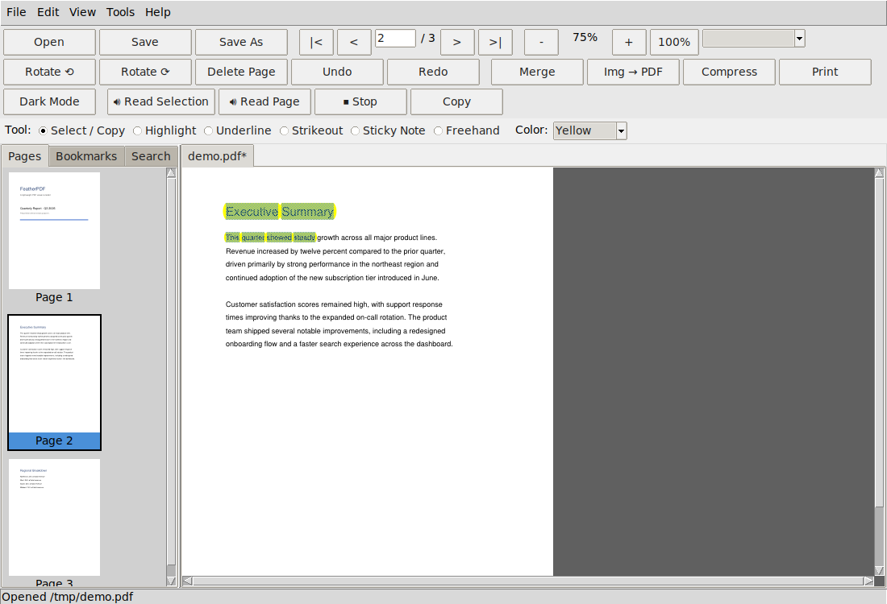

<div align="center">


# FeatherPDF — Walkthrough

</div>

A guided tour through every feature. Launch the app first:

```bash
python main.py
```

You'll see a short animated splash, then the main window: menu bar at the
top, the main toolbar below it, the annotation toolbar below that, a
sidebar on the left (Pages / Bookmarks / Search tabs), and the main
viewing area on the right. Both toolbars auto-wrap their buttons to fit
however wide your window is — resize the window and you'll see them
reflow into more or fewer rows automatically, so nothing ever gets
cut off the edge.

<div align="center">

<br>
<sub>The main window — text selected and highlighted, thumbnails on the left.</sub>
</div>

---

## 1. Opening files

- **File → Open...** (or `Ctrl+O`, or the **Open** toolbar button) — you
  can select multiple PDFs at once; each opens in its own tab.
- If a PDF is password-protected, you'll be prompted for the password
  before it opens.
- Recently opened files are remembered in `config/settings.json`.

## 2. Viewing & navigating

- **Page navigation**: use the `|<`, `<`, `>`, `>|` buttons in the
  toolbar, type a page number directly into the page box and press Enter,
  or use `Page Up` / `Page Down` / `Home` / `End` on your keyboard.
- **Zoom**: `+` / `-` buttons, `Ctrl` + `+`/`-`, `Ctrl+Scroll wheel`, or
  the `100%` button to reset to actual size.
- **Fit modes**: the dropdown next to the zoom controls offers *Fit
  Width*, *Fit Page*, *Fit Screen*, or *Manual Zoom* (locks the zoom level
  so it doesn't change when you resize the window).
- **Thumbnails**: click the **Pages** tab in the left sidebar. Click any
  thumbnail to jump to it. Right-click a thumbnail for a context menu
  (delete, insert blank before/after, move up/down).
- **Bookmarks**: click the **Bookmarks** tab to see the PDF's table of
  contents (if it has one) — click any entry to jump there.
- **Dark mode**: the **Dark Mode** toolbar button inverts the page colors
  for comfortable reading (this only affects how the page is displayed,
  not the saved file).

## 3. Searching text

- Click the **Search** tab in the left sidebar.
- Type your query and press Enter (or click **Find**).
- Matches are found across the whole document; the status line shows
  "Match X of Y". Use **◀ Prev** / **Next ▶** to jump between them — the
  view automatically navigates to the page containing each match, and the
  current match is outlined in orange on the page.

## 4. Editing pages

- **Delete current page**: toolbar's **Delete Page** button, or
  `Edit → Delete Page`, or the `Delete` key.
- **Delete a range**: `Edit → Delete Page Range...` — type something like
  `2-4,7` to delete pages 2 through 4 and page 7.
- **Insert a blank page**: `Edit → Insert Blank Page` (inserts right after
  the current page).
- **Reorder pages**: in the **Pages** sidebar, right-click a thumbnail and
  choose **Move Up** / **Move Down**.
- **Rotate**: the toolbar's rotate buttons (⟲ / ⟳) rotate the *current*
  page permanently — this is saved with the file, unlike dark mode.
- **Undo / Redo**: `Ctrl+Z` / `Ctrl+Y` — works across page deletes, inserts,
  reorders, rotations, and annotations.

## 5. Annotating

The **annotation toolbar** (below the main toolbar) handles this:

1. Pick a tool: **Select / Copy** (the default), **Highlight**, **Underline**,
   **Strikeout**, **Sticky Note**, or **Freehand**.
2. Pick a color from the dropdown.
3. Click and drag on the page. For **Highlight/Underline/Strikeout**, if you
   drag over real text it snaps to the exact words; dragging over empty space
   (like a diagram) marks the dragged rectangle instead. For **Freehand**,
   just draw — it follows your cursor like a pen. **Sticky Note** places a
   note icon where you click.
4. Switch back to **Select / Copy** when you're done annotating, so normal
   dragging goes back to selecting text.

Annotations are part of the PDF once you save — they'll show up in any
other PDF viewer too.

## 5a. Selecting, copying, and reading text aloud

With the **Select / Copy** tool active (the default), click and drag over
any text to select it — you'll see it highlighted in blue as you drag.
Selection follows true document reading order, so dragging across lines
selects continuously from the start of your drag on line 1 through to the
end of your drag on line 3.

- **Copy**: `Ctrl+C`, the toolbar's **Copy** button, or right-click → **Copy**.
  The selected text goes straight to your system clipboard — paste it
  anywhere with `Ctrl+V`.
- **Read Selection Aloud**: right-click → **Read Selection Aloud**, or the
  toolbar's **🔊 Read Selection** button. Uses your OS's own speech engine.
- **Read Page Aloud**: reads the entire current page's text, even without a
  selection — toolbar's **🔊 Read Page** button, or right-click menu.
- **Slower / Faster Speed**: use the **Slower** and **Faster** toolbar
  buttons to adjust reading speed from 0.5x to 2.0x (the current multiplier
  is displayed right on the toolbar).
- **⏹ Stop**: stops reading at any point.
- **Right-click menu shortcuts**: while you have a selection, right-clicking
  also offers **Highlight/Underline/Strikeout Selection** directly — no need
  to switch tools first.

If nothing happens when you click Read Aloud, your system may not have a
speech engine installed — on Linux, run `sudo apt install espeak` and try
again. Windows and macOS have one built in already.

## 6. Merging PDFs

- **Tools → Merge PDFs...** (or `Ctrl+M`, or the **Merge** toolbar button).
- Click **Add Files...** to select PDFs, then use **Move Up** / **Move
  Down** to set the order they'll appear in the merged file.
- Click **Merge** — the result opens as a new tab called `Merged.pdf`.
  Save it with `Ctrl+S` wherever you like.

## 7. Splitting & extracting

- **Tools → Extract Pages...**: type a page range (e.g. `1-3,5`) to pull
  just those pages into a new document, opened as a new tab.
- **Tools → Split Every N Pages...**: enter a number, and the current
  document is chopped into consecutive chunks of that size, each opening
  as its own tab (`Split_part1.pdf`, `Split_part2.pdf`, ...).

## 8. Converting images to PDF (with scan effects & auto-crop)

- **Tools → Images to PDF...** (or the **Img → PDF** toolbar button).
- Click **Add Images...**, arrange their order with Move Up/Down.
- **Auto-Crop** (optional): automatically detects the document's edges
  in each photo and straightens it — even if it was photographed at a real
  angle, not held flat. Mobile photos are automatically rotated right-side up
  via EXIF tags. If a photo has no clear document edge to find (busy background,
  edge not visible), that one image is left as-is rather than risking a bad crop.
  This checkbox defaults to on whenever OpenCV is installed (or when running
  the dedicated AutoCrop build) — if OpenCV isn't installed, the checkbox is
  disabled with a note telling you how.
- Choose a **Document Style**:
  - *No effect* — keeps the image exactly as photographed (or as auto-cropped).
  - *Color document* — boosts contrast and sharpness, keeps color.
  - *Grayscale document* — same, converted to grayscale.
  - *Black & white scan (CamScanner-style)* — adaptive thresholding for
    that classic high-contrast scanned-page look.
  - Auto-Crop runs *before* whichever style you pick, so you can combine
    "straighten the angle" with "make it look like a scan" in one pass.
- Choose a **Page Size**: match each image's own aspect ratio, or force
  everything onto a fixed A4 page (image centered and scaled to fit).
- Click **Convert** — opens as a new tab, `Converted.pdf`, and reports the
  exact count of auto-cropped images in the status bar.

## 9. Compressing a PDF

- Open the PDF you want to shrink, then **Tools → Compress PDF...**.
- Adjust the **Max DPI** slider — any embedded image above this effective
  resolution gets downsampled; anything already at or below it is left
  untouched, so quality that matters isn't lost.
- Adjust **JPEG Quality** for the recompression step.
- Click **Estimate** to see a rough before/after size comparison before
  committing.
- Click **Compress** to apply it (this is undoable with `Ctrl+Z`).

## 10. Document properties & password protection

- **File → Document Properties...**
- Edit Title / Author / Subject / Keywords / Creator / Producer, then
  **Save Metadata** (takes effect once you save the file).
- To create a password-protected copy: enter a password in the lower
  section and click **Save Encrypted Copy...** — this saves a *separate*
  file and doesn't touch your currently open document.

## 11. Printing

- **File → Print...** or `Ctrl+P`. If the document has unsaved changes,
  you'll be asked to save first (printing hands the file path to your
  OS's native print system, so it needs a real file on disk).

## 12. Multiple documents at once

- Every open PDF gets its own tab across the top of the viewing area.
- Each tab has fully independent zoom, page position, undo history, and
  search state — switching tabs never mixes them up.
- `Ctrl+W` closes the current tab (you'll be warned if it has unsaved
  changes).

---

## Keyboard shortcuts reference

| Shortcut | Action |
|---|---|
| `Ctrl+O` | Open file(s) |
| `Ctrl+S` | Save |
| `Ctrl+Shift+S` | Save As |
| `Ctrl+W` | Close tab |
| `Ctrl+Z` / `Ctrl+Y` | Undo / Redo |
| `Ctrl+F` | Jump to Search sidebar |
| `Ctrl+C` | Copy selected text |
| `Ctrl+ +` / `Ctrl+ -` | Zoom in / out |
| `Ctrl+0` | Reset zoom to 100% |
| `Page Up` / `Page Down` | Previous / next page |
| `Home` / `End` | First / last page |
| `Ctrl+G` | Go to page (dialog) |
| `Ctrl+P` | Print |
| `Ctrl+M` | Merge dialog |
| `Delete` | Delete current page |
| `F11` | Toggle full screen |

---

## Troubleshooting

- **"Could not open file" on a PDF that opens fine elsewhere**: it may be
  using a PDF feature PyMuPDF doesn't parse the same way as Acrobat; try
  re-saving it from another tool first.
- **Compress shows "0 images touched"**: this is correct if every embedded
  image is already at or below your DPI threshold — there's nothing
  wasteful to shrink.
- **Auto-Crop checkbox is grayed out**: OpenCV isn't installed — run
  `pip install -r requirements-optional.txt`, then reopen the dialog.
- **Auto-Crop left an image untouched**: it couldn't find a confident
  4-sided document edge in that photo (busy background, edge not
  visible, etc.) and deliberately left it as-is rather than risk a wrong
  crop — this is the intended fallback, not a bug.
- **Print does nothing on Linux**: printing shells out to `lp`; make sure
  a CUPS printer is configured (`lpstat -p` to check).
- **`pyinstaller: command not found` on Windows** (when building a
  standalone .exe): pip installed it to a user folder that isn't on your
  PATH. Run `python -m PyInstaller build/pyinstaller.spec --workpath build/_cache`
  instead of the bare `pyinstaller` command — see README.md's build
  section for details (the `--workpath` part avoids a separate issue where
  PyInstaller's own build cache collides with the checked-in spec file).
- **The built app runs on my machine but not on someone else's**: see
  README.md's "Why a build works here but not on another machine"
  section — almost always it's the `.exe` having been separated from its
  `_internal/` folder. Build the Inno Setup installer (also in README.md)
  instead of hand-zipping the `dist/` folder and this stops being possible.

---

<div align="center">

Licensed under Attribution — Non-Commercial (see [LICENSE](LICENSE)) — free to use and modify, just credit the original when you share it.

FeatherPDF — made by **[Mehedy](https://mehedy.netlify.app)**

</div>

